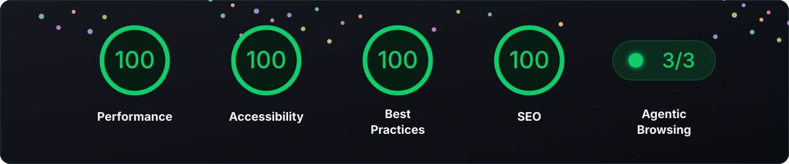

<h1 align="center">Kamil Nowak — Interactive 3D Portfolio</h1>

<p align="center">
  A cinematic portfolio combining reliable engineering with motion, visual depth and real-time graphics.
</p>

<p align="center">
  <a href="https://nowakkamil.com">Live website</a>
  ·
  <a href="https://www.linkedin.com/in/nowakkamil">LinkedIn</a>
  ·
  <a href="https://github.com/nowakkamil">GitHub</a>
</p>

<p align="center">
  
  
  
</p>

## About the project

This is not a template-based portfolio or a static collection of cards. It is an exploration of how software engineering, interface design, animation and real-time rendering can work together without sacrificing clarity, accessibility or maintainability.

The experience has two main goals: to present my work through a distinctive visual identity and to make moving through it feel natural. **Three.js**, custom **GLSL shaders** and particles create the atmosphere, while **GSAP** connects scrolling, camera movement, text and shader transitions into one coherent timeline.

Visitors can explore my professional experience, education and recommendations, navigate an interactive constellation of projects, and get in touch directly through the website.

## Behind the experience

🌌 **Cinematic WebGL environment:** particles, lighting, fog, bloom and section-aware shaders<br>
🧭 **Scroll-directed storytelling:** coordinated DOM, camera and shader transitions<br>
✨ **Project constellation:** connected projects with keyboard-operable details and navigation<br>
📱 **Responsive rendering:** dedicated camera, layout and effect settings for smaller devices<br>
⚡ **Performance:** bounded frame updates, reusable scene objects and geometry work moved to a Web Worker<br>
♿ **Accessibility:** semantic content, reduced-motion support and professional information kept outside WebGL<br>
🔎 **SEO:** structured data, social metadata, sitemap and a canonical custom domain

The application is organised into focused modules for page sections, rendering systems, shaders, interactions and styling. `main.ts` acts primarily as a composition root instead of holding the full implementation.

React is part of my professional stack, but this project does not need a large component state model. Native DOM APIs and modular TypeScript keep the interface lightweight and allow the visual layer to remain independent.

## Quality audit ✨

<p align="center">
  
</p>

**100 Performance · 100 Accessibility · 100 Best Practices · 100 SEO · 3/3 Agentic Browsing**

The perfect sweep is a small but meaningful achievement for a visually complex portfolio powered by Three.js, WebGL, custom shaders and extensive animation.

Results captured on **20 August 2026 at 20:52 GMT+2** from an initial single-page desktop load. The audit used Lighthouse 13.4.0, Chromium 151 and custom throttling.

## Core technologies

🟦 **Language and tooling:** TypeScript, Vite<br>
🎨 **Rendering:** Three.js, WebGL, GLSL<br>
🎬 **Motion:** GSAP, ScrollTrigger, ScrollSmoother, SplitText<br>
🖌️ **Styling:** SCSS<br>
🧵 **Background processing:** Web Worker<br>
☁️ **Hosting:** Cloudflare Pages and GitHub Pages

## Email templates

The repository also contains the email assets used by the contact flow:

- [Customer confirmation email](emails/README.md) — build, variables and sending behaviour;
- [Email signature](emails/signature/README.md) — Spark installation and testing.

## Search and image checks

SEO is focused on the portfolio itself and does not require a separate publishing workflow.

```bash
npm run seo:check        # validate the production SEO output in dist/
npm run images:generate  # regenerate responsive project-image variants
npm run images:check     # verify image dimensions, sizes and fallbacks
```

The deployment and recurring Google Search Console/Bing Webmaster Tools checklist is documented in [docs/seo-operations.md](docs/seo-operations.md).

## Local development

You will need a recent Node.js release, npm and a browser with WebGL support.

```bash
npm install
npm run dev
```

Useful commands:

```bash
npm run typecheck  # validate TypeScript
npm run lint       # check code and styles
npm test           # run contact-form tests
npm run build      # create the production build
npm run preview    # preview the generated site
```

The contact form uses Cloudflare Pages Functions, Turnstile and Resend. A production setup requires `VITE_TURNSTILE_SITE_KEY`, `TURNSTILE_SECRET_KEY`, `RESEND_API_KEY`, `CONTACT_SENDER` and `CONTACT_RECIPIENT`. Visitor confirmation emails can be enabled with `SEND_VISITOR_CONFIRMATION=true`.

## Deployment

The primary version is served through Cloudflare Pages at [nowakkamil.com](https://nowakkamil.com/). The [GitHub Pages deployment](https://nowakkamil.github.io/) remains available as an alternate address, while the custom domain is canonical for search engines and public sharing.

## About me

I am a senior full-stack developer specialising in **React, TypeScript and .NET**. I build robust applications across front end, back end and cloud infrastructure, and particularly enjoy transforming ambitious visual concepts into maintainable digital products.

My interest in Three.js, WebGL and digital motion draws on a background in fine-art photography and compositing — the point where technical problem-solving and visual experimentation meet.

## License

Unless a separate licence file states otherwise, the source code, visual design, text, shaders, media and project assets are provided for evaluation and demonstration purposes. They may not be copied, redistributed or used as a template without permission. Third-party libraries and assets remain subject to their respective licences.

<p align="center">
  <i>
    Built with TypeScript, Three.js, GLSL, GSAP, SCSS and a refusal to make another ordinary portfolio.
  </i>
</p>
